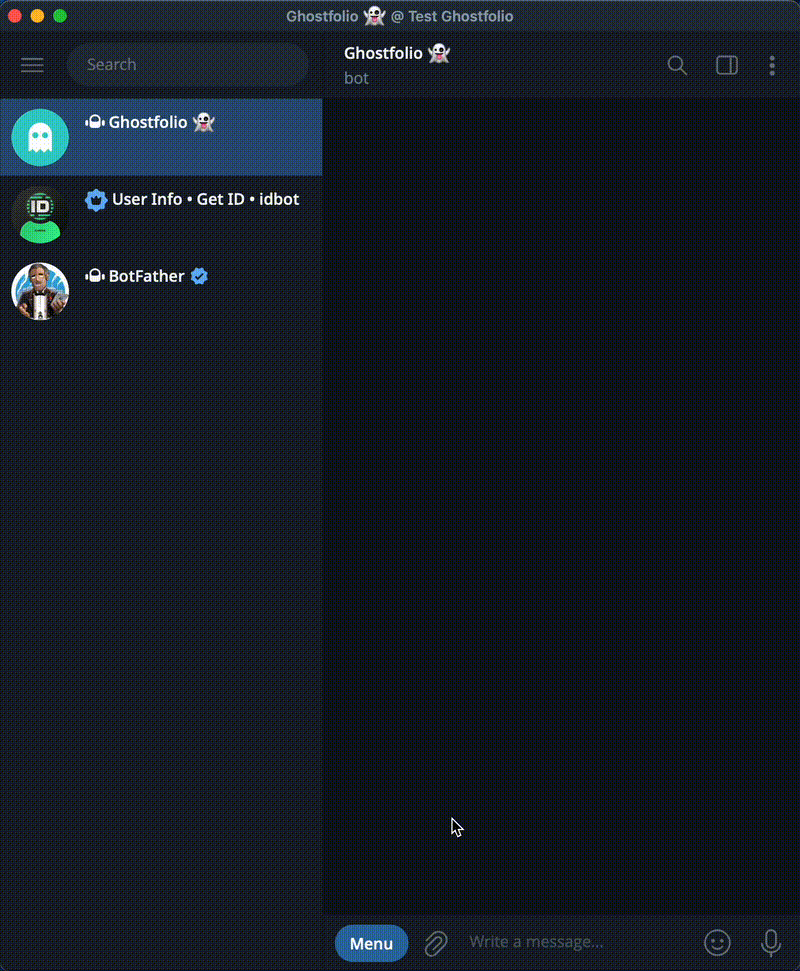
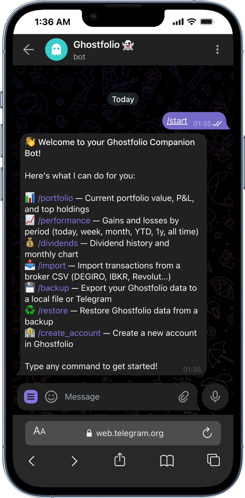
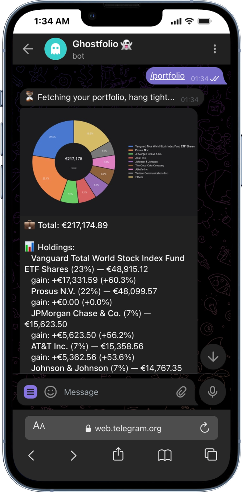
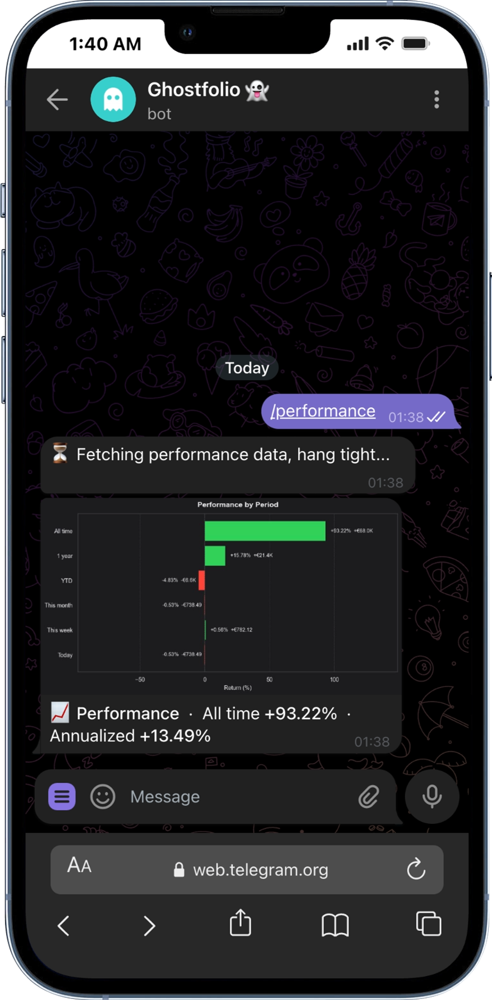
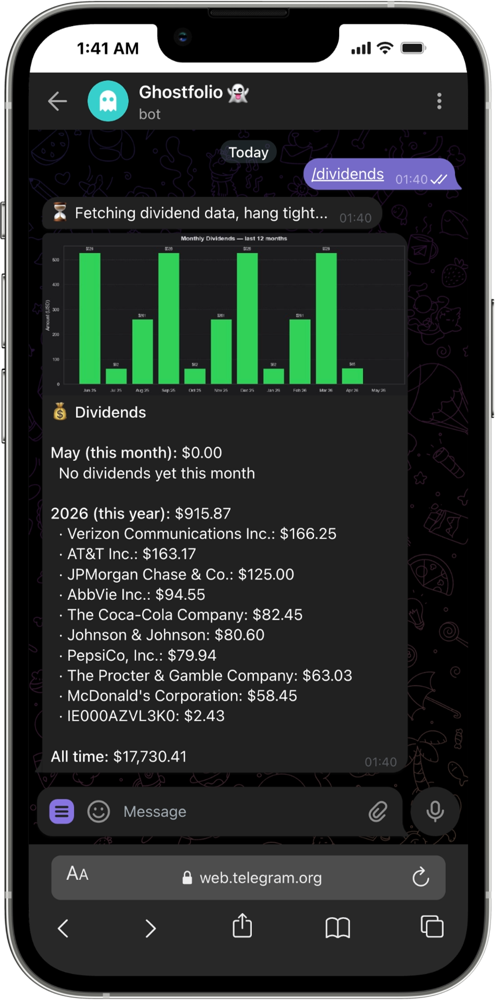
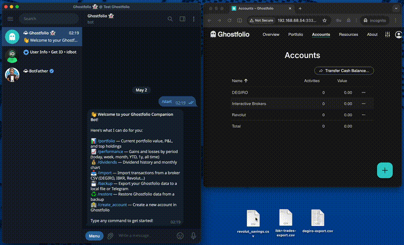

# Ghostfolio Companion Bot

A Telegram bot that acts as a companion to your [Ghostfolio](https://github.com/ghostfolio/ghostfolio) instance — self-hosted or cloud. Import broker CSVs, track your portfolio, and manage accounts — all from Telegram.



> **Works with any Ghostfolio instance.** The bot connects via the Ghostfolio REST API — point it at your self-hosted server or at [ghostfol.io](https://ghostfol.io). Primarily designed for self-hosted setups where you control your data.

---

## Quick start

### Prerequisites

- Python 3.12+
- A running [Ghostfolio](https://github.com/ghostfolio/ghostfolio) instance
- A Telegram bot token (see below)
- [`uv`](https://docs.astral.sh/uv/) (recommended) or `pip`

#### Creating a Telegram bot

1. Open Telegram and search for **[@BotFather](https://t.me/BotFather)**, then send `/start`.
2. Send `/newbot` and follow the prompts — choose a display name (e.g. `My Ghostfolio Bot`) and a username ending in `bot` (e.g. `mygf_bot`).
3. BotFather replies with your **bot token** — a string like `123456789:ABCdef...`. Copy it.
4. To find your **Telegram user ID**, send `/start` to [@userinfobot](https://t.me/userinfobot) — it replies with your numeric ID. Add it to `TELEGRAM_ALLOWED_USERS` so only you can use the bot.

### 1. Clone and install

```bash
git clone https://github.com/YOUR_USERNAME/ghostfolio-bot.git
cd ghostfolio-bot
uv sync
```

### 2. Configure

```bash
cp .env.sample .env
```

Edit `.env`:

```env
TELEGRAM_BOT_TOKEN=your-bot-token-from-botfather
TELEGRAM_ALLOWED_USERS=123456789         # your Telegram user ID
GHOSTFOLIO_URL=http://localhost:3333     # your Ghostfolio URL
GHOSTFOLIO_ACCESS_TOKEN=your-token       # Settings → Security → Access token
GHOSTFOLIO_ACCOUNT_ID=your-account-uuid  # account to import activities into
IMPORT_MODE=direct                       # "direct" or "json"
```

### 3. Run

```bash
uv run ghostfolio-bot
```

---

## Commands

<table>
<tr>
<td style="width:50%;vertical-align:top">

### `/start`

Welcome message with a summary of available commands.



</td>
<td style="width:50%;vertical-align:top">

### `/portfolio`

Portfolio summary: current value, total P&L, and your top holdings ranked by allocation.



</td>
</tr>
<tr>
<td style="width:50%;vertical-align:top">

### `/performance`

Gain/loss dashboard across every time period — today, this week, this month, YTD, 1 year, and all time — with a bar chart of period-by-period returns.



</td>
<td style="width:50%;vertical-align:top">

### `/dividends`

Dividend history: this month, this year, all-time totals, and a 12-month bar chart showing income over time.



</td>
</tr>
</table>

---

### `/import`

Upload a broker CSV (or XLS) and the bot handles the rest:

1. **Auto-detects** the broker by matching the file header against known signatures
2. **Resolves symbols** via Yahoo Finance (ISIN → ticker), with an on-disk cache
3. **Deduplicates** against existing Ghostfolio activities
4. Shows a **preview** — new vs skipped — before you confirm



#### Supported brokers

| Broker | Type | Notes |
|--------|------|-------|
| Revolut Stocks | CSV | BUY, SELL, DIVIDEND |
| Revolut Savings | CSV | INTEREST |
| Revolut Crypto | CSV | BUY, SELL |
| DEGIRO | CSV | Dutch & English exports; fee pairing |
| IBKR (Interactive Brokers) | CSV | Trades & Dividends exports |
| MyInvestor | XLS | Spanish broker |
| Delta | CSV | Crypto portfolio tracker |

> **Want to add a broker?** See [Adding a parser](#adding-a-parser).

#### Import mode

Set `IMPORT_MODE` in `.env`:

| Value | Behaviour |
|-------|-----------|
| `direct` | Activities are posted straight to Ghostfolio via the API |
| `json` | Generates a JSON file you can import manually via the Ghostfolio UI |

---

### `/backup`

Export your full Ghostfolio data on demand. Backups are compressed with gzip and can optionally be encrypted.

Set `BACKUP_STORAGE` in `.env`:

| Value | Behaviour |
|-------|-----------|
| `telegram` | Bot sends you the backup as a `.json.gz` file in chat (default) |
| `local` | Saved to `BACKUP_LOCAL_DIR` on the server (persisted via Docker volume) |

**Automatic backups** — set a schedule so backups run without manual action:

```env
BACKUP_SCHEDULE=daily      # every day at 2am
BACKUP_SCHEDULE=weekly     # every Monday at 2am
BACKUP_SCHEDULE=monthly    # 1st of each month at 2am
BACKUP_SCHEDULE=quarterly  # 1st of Jan, Apr, Jul, Oct at 2am
```

**Encryption** — optionally encrypt backups before saving or sending. Files are saved as `.json.gz.enc` and can only be opened with the key.

1. Generate a key:
   ```bash
   python -c "from cryptography.fernet import Fernet; print(Fernet.generate_key().decode())"
   ```
2. Add it to `.env`:
   ```env
   BACKUP_ENCRYPTION_KEY=your-generated-key
   ```

Keep the key somewhere safe — without it the backup cannot be decrypted.

**Decrypting a backup manually:**

```python
from cryptography.fernet import Fernet
import gzip, json

BACKUP_ENCRYPTION_KEY = "your-key-from-.env"

with open("ghostfolio_backup_2026-01-01_000000.json.gz.enc", "rb") as f:
    encrypted = f.read()

json_bytes = gzip.decompress(Fernet(BACKUP_ENCRYPTION_KEY.encode()).decrypt(encrypted))
data = json.loads(json_bytes)
print(json.dumps(data, indent=2))
```

---

### `/restore`

List available local backups and restore your Ghostfolio data from a previous export.

---

### `/create_account`

Create a new Ghostfolio account directly from Telegram without opening the web UI.

---

## Docker

Make sure you have a `.env` file configured (see [Configure](#2-configure)), then:

```bash
# Start the bot in the background
docker compose up -d

# Build the image and start (use this after code changes)
docker compose up -d --build

# View logs
docker compose logs -f

# Stop the bot
docker compose down
```

The container restarts automatically on failure or system reboot (`restart: unless-stopped`). Ghostfolio itself is external — just point `GHOSTFOLIO_URL` at your instance.

> If your Ghostfolio runs in Docker on the same machine, set `GHOSTFOLIO_URL=http://host.docker.internal:3333` so the bot can reach it.

The compose file mounts a `./backups` directory from the host into the container so local backups survive container restarts and image updates:

```yaml
volumes:
  - ./backups:/app/backups
```

---

## Development

```bash
# Install with dev dependencies
uv sync --extra dev

# Run tests
uv run pytest

# Lint (required — auto-fixable with --fix)
uv run ruff check .

# Type check (optional but appreciated)
uv run mypy bot
```

### Adding a parser

1. Create `bot/parsers/mybroker.py`
2. Inherit from `BrokerParser` and decorate with `@register_parser`
3. Set `NAME`, `HEADER_SIGNATURE`, `DELIMITER`, and implement `parse()`
4. Add an import in `bot/parsers/__init__.py`
5. Add tests in `tests/test_mybroker.py`

```python
from bot.parsers.base import BrokerParser, register_parser

@register_parser
class MyBrokerParser(BrokerParser):
    NAME = "MyBroker"
    HEADER_SIGNATURE = "Date,Type,Symbol,Quantity,Price,Fee,Currency"

    def parse(self, csv_text: str) -> list[dict]:
        ...
```

See [`bot/parsers/revolut/savings.py`](bot/parsers/revolut/savings.py) for a minimal working example.

---

## Contributing

Contributions are welcome! Please open an issue before submitting a pull request for significant changes.

1. Fork the repo and create a feature branch
2. Make sure `ruff check .` passes (required) — run `ruff check . --fix` to auto-fix most issues
3. Add or update tests for your change
4. Type annotations are appreciated but not required to get a PR merged
5. Open a PR with a clear description

---

## License

[AGPL-3.0](LICENSE) — any modified version deployed as a network service must also be open source.

---

## Acknowledgements

Inspired by [export-to-ghostfolio](https://github.com/dickwolff/export-to-ghostfolio) — the TypeScript reference implementation for broker CSV → Ghostfolio import.

---

## Disclaimer

This project is provided as-is, without any warranty of any kind. Use it at your own risk. The authors are not responsible for any data loss, corruption, or unintended changes to your Ghostfolio instance.
